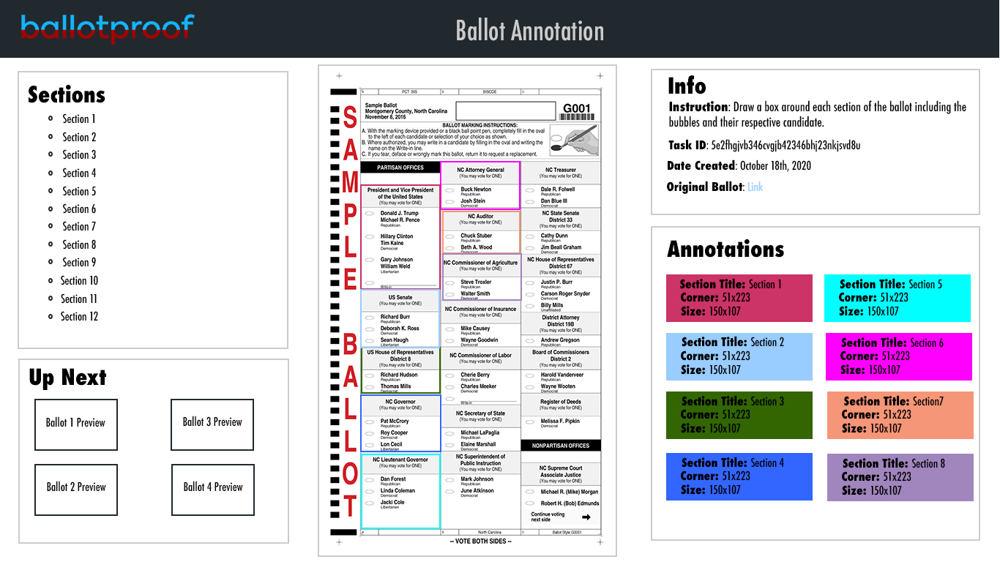

## Voting made faster, smarter, and more secure.

\@authors:\
[\@Devrath Iyer](https://github.com/DevrathIyer) (Stanford '24)\
[\@Ethan Shaotran](https://github.com/Shaotran) (Harvard '25)\
[\@Koushik Sridhar](https://github.com/koushiksridhar) (UNC '24)\
[\@Pratham Soni](https://github.com/PrathamSoni) (Stanford '24)

## Introduction
With an emphasis on social distancing and remote engagement as a result of the COVID-19 pandemic mail-in voting surged from 24.9% to 50.3% of ballots [1] in the 2016 and 2020 primaries, respectively. This surge will also trigger an unfortunate increase in ballots rejected due to the avoidable human error; we’ve already started to see the effects, with half a million ballots rejected [2] in the 2020 primaries. As first-time voters, this issue is extremely critical to us as our generation seeks democratic representation. In an effort to reduce rejection rates, we introduce BallotProof, a methodology built for faster, smarter, and more secure validation of ballots.

## What It Does
BallotProof is built from the ground up with ease of use and security in mind. As a result, the platform was developed with a server-independent structure, with all image analysis done on the client-side to avoid any risk of data leakage. BallotProof takes in input images of the front and back sides of your ballot and uses image analysis to specifically determine which errors can prevent your critical vote from being counted. We handle everything for you from start to finish, with automatic cropping of your pictures to showing exactly which sections in which errors were made and specific templates made for your unique ballot.

Our methods are currently able to point out if you've made any of the following:
1.	Incorrect pen colors
2.	Blank sections
3.	Excessive bubble fill-ins
4.	Improper write-in format
5.	Ban bubble fill-ins
6.	And much more!

**And all you need to do is enter your address and take pictures of two images without fear of your data being compromised!**

## How we built it (Programs, Tools, & APIs)
So how did we make it happen?
- Geocodio - API for Congressional District Checking
- OpenCV.js - In-browser image processing for cropping and analysis
- PIL - Generation of test examples.
- Django - Provisioning website backend.
- Amazon AWS S3 - Hosting annotation files.
- Python - Django and example generation.
- HTML - Website structure.
- JavaScript - Scripts including data loading and analysis
- Heroku - Server hosting platform.
- Domain.com - Our domain name: www.BallotProof.tech :)

## Future Steps
We do recognize that there are limitations in our project. We are committed to the continual improvement of BallotProof as a service to facilitate greater participation in democracy. In particular, we wish to continue to improve our analysis algorithms, especially automatic cropping. We also wish to include additional testing fields such as required signatures and dates, and our current data structures are set up for that integration. With additional time, tools like Tensorflow JS are appealing as ways to incorporate deep learning within the scope of our work.

Aside from the technical front, a significant part of our goal is increased accessibility. To do that, we must partner with local governments to gain access to sample ballots, so that we may construct annotation masks for our analysis. As part of that, we plan to build a annotation tool that will drastically reduce the man-hours it currently takes for us to draw information from the raw ballot. A mock-up of the annotation UI is attached below.

## Notice
ALL BALLOT IMAGES ARE AUTOGENERATED BY A COMPUTER FROM A SINGULAR SAMPLE BALLOT.
THESE BALLOTS DO NOT EXIST PHYSICALLY AND ARE NOT INTENDED TO BE SUBMITTED AT A
POLLING LOCATION OR BE SENT IN THE MAIL.

The generation script (generate.py) enables the generation of semi-randomized
ballots that fit certain satisfiability criteria. We use these sample ballots
as tests for model functionality.

## Attributions
- A huge thanks to HackGT for setting up this great event, the opportunity to
compete, and the great events over the weekend.
- We thank the OpenCV guide for getting us started for in-browser image analysis.

[1]: https://www.pewresearch.org/fact-tank/2020/10/13/mail-in-voting-became-much-more-common-in-2020-primaries-as-covid-19-spread/?fbclid=IwAR3atHgIz8Fi1KZCuDHHr9I_XsJjnS5uiLbjRVeeY7h2-Vp9_q8expubtCw
[2]: https://www.washingtonpost.com/politics/rejected-mail-ballots/2020/08/23/397fbe92-db3d-11ea-809e-b8be57ba616e_story.html?fbclid=IwAR2UdN9JlgRR4iQWR6_vXgmU69rCreKc_dUq_8kbpow3coJHwY4elV3UgSc
